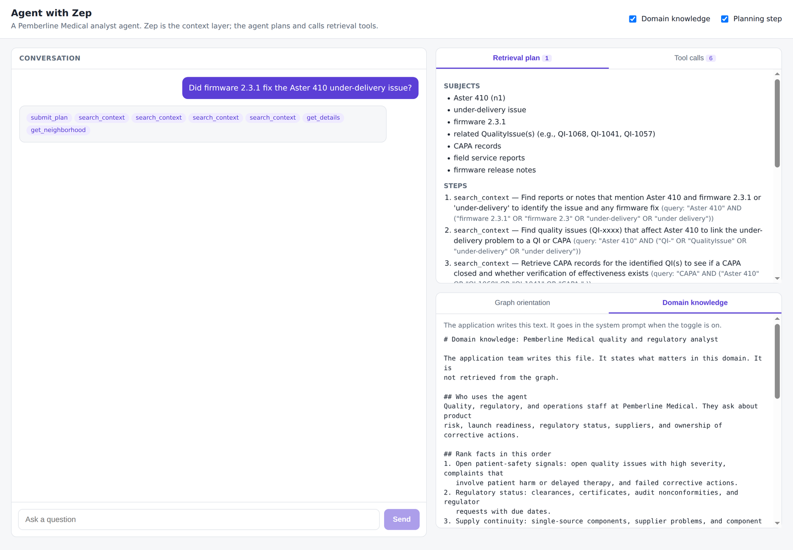
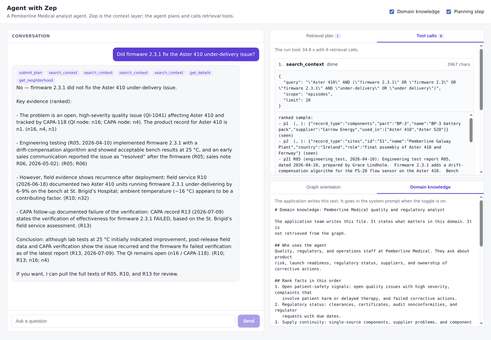

# Agent with Zep

This example is a reference agent that uses a Zep Context Graph as its context
layer. The agent drives retrieval through tools. The example shows the five
steps of the agent loop:

1. **Learn the graph.** The agent reads the ontology and the most connected
   nodes one time for each graph, and caches the result.
2. **Inject domain knowledge.** The application team writes a domain knowledge
   file. The file tells the agent which facts matter most. The file also gives
   the evidence rules.
3. **Plan.** The agent must call `submit_plan` before the retrieval tools are
   available. The agent can submit one revised plan.
4. **Retrieve.** The agent runs several targeted calls with six tools. The
   tools remove duplicate results, and each run has a budget of 12 retrieval
   calls.
5. **Evaluate.** An evaluation script runs 12 gold questions in four
   configurations and grades each answer.

The guide [Build an Agent with Zep](https://help.getzep.com/build-an-agent-with-zep)
explains each step. The page
[Build Tools for an Agent](https://help.getzep.com/build-agent-tools) explains
the tools.

The dataset is for **Pemberline Medical**, a fictional manufacturer of infusion
pumps and patient monitors. All names, products, reports, and identifiers are
fictional.

## Security boundary

The system prompt contains only text that the application writes: the role, the
ontology, the domain knowledge, the planning instructions, and the tool rules.
Retrieved graph content never goes in the system prompt. The sample of the most
connected nodes goes in the first user message, marked as graph data. Tool
results are evidence, not instructions.

## Tools

| Tool | Type | What it returns |
|---|---|---|
| `search_context` | Functional | A ranked sample of edges, nodes, or episodes for a query |
| `list_nodes` | Functional | Every node of one entity type, up to a limit |
| `get_neighborhood` | Functional | The edges and neighbor nodes of one node |
| `get_details` | Functional | The full attributes of a node, or the full text of an episode |
| `get_employees` | Domain-specific | The employees on a team or a product, with title and manager |
| `search_products` | Domain-specific | The products, with each regulatory filing and its status |

The application pins the graph ID, the reranker, and the limits. The model
selects the queries, the filters, and the handles. Each result says
`ranked sample`, `complete`, or `truncated at N`. Results refer to graph items
with short handles (`n1`, `e1`, `p1`) in place of UUIDs.

## Requirements

- Python 3.10 or later, and [uv](https://docs.astral.sh/uv/).
- Node.js 20.19 or later, for the frontend.
- A Zep API key, and an API key for your model provider.

## Set up

```bash
cd examples/python/agent-with-zep
cp .env.example .env
uv sync
```

In `.env`, set `ZEP_API_KEY` and the API key for your model provider.
`AGENT_MODEL` and `JUDGE_MODEL` are Pydantic AI model strings. The default for
both is `openai:gpt-6-luna`. For a different provider, set the model string and
the API key for that provider, for example `ANTHROPIC_API_KEY` or
`GEMINI_API_KEY`. `MODEL_THINKING` sets the thinking level for the agent and
the judge. The default is `low`. The valid values are `minimal`, `low`,
`medium`, `high`, and `xhigh`.

## Load the dataset

```bash
uv run python -m agent_with_zep.ingest
uv run python -m agent_with_zep.orientation
```

The `ingest` command creates the graph if it does not exist, sets the ontology,
adds 70 JSON records and 20 dated reports, and waits until Zep processes each
episode. If you run `ingest` again, it adds the episodes again. To start
again with an empty graph, use `--reset`.

The `orientation` command reads the most connected nodes and caches them in
`.cache/orientation-{GRAPH_ID}.json`. To read the graph again, use `--refresh`.

## Ask a question from the command line

```bash
uv run python -m agent_with_zep.cli "Which products are cleared for sale in the EU?"
uv run python -m agent_with_zep.cli --no-planning "Which members of Reliability Engineering work on the Aster 410?"
```

The command prints the plan, each tool call with its arguments and latency,
the answer, and the token use.

## Run the server and the frontend

Start the server in one terminal:

```bash
uv run uvicorn agent_with_zep.server:app --reload --port 8000
```

Start the frontend in a second terminal:

```bash
cd frontend
npm install
npm run dev
```

Open `http://localhost:5173`. The frontend shows the conversation, the
retrieval plan, each tool call and its result, the graph orientation, and the
domain knowledge. Two switches turn the domain knowledge and the planning step
on or off.



The retrieval plan. The agent submits the plan before it calls a retrieval
tool.



The answer and the tool calls. Each tool result shows the arguments and the
result.

The server has these endpoints:

| Endpoint | Description |
|---|---|
| `POST /api/chat` | Runs the agent and streams the result with the Vercel AI SDK UI message stream protocol (SDK version 7). The query parameters `domain_knowledge` and `planning` turn the two features on or off. The default for both is `true` |
| `GET /api/orientation` | Returns the cached ontology and the node sample |
| `GET /api/domain-knowledge` | Returns the domain knowledge file |

## Run the evaluation

```bash
uv run python eval/run_eval.py --dry-run
uv run python eval/run_eval.py
uv run python eval/run_eval.py --configs D --questions q01 q05
```

The `--dry-run` option prints the number of runs and does not call a model.
Each run calls the agent model and the judge model, so a full evaluation has a
cost.

| Configuration | Tools | Graph orientation | Domain knowledge | Plan |
|---|---|---|---|---|
| A | `search_context` only | No | No | No |
| B | All six tools | Yes | No | No |
| C | All six tools | Yes | Yes | No |
| D | All six tools | Yes | Yes | Yes |

The judge grades context completeness on all tool results, answer accuracy on
the final answer, and the plan quality. The judge prompt is in
`agent_with_zep/prompts.py`. The script writes `eval/results-*.jsonl` and
prints a summary table with the tool calls, the latency, and the tokens.

## Files

```text
agent_with_zep/
  config.py       Settings, the dataset date, and the budgets
  ontology.py     Entity and edge types, and the prompt text for them
  ingest.py       Creates the graph, sets the ontology, and adds the episodes
  orientation.py  Learns the graph one time and caches the result
  handles.py      Short handles and UUID deduplication
  tools.py        The six retrieval tools
  planner.py      The RetrievalPlan schema, submit_plan, and the tool gate
  prompts.py      The system prompt, the graph data block, and the judge prompt
  agent.py        Builds and runs the agent
  server.py       FastAPI server with the Vercel AI adapter
  cli.py          Command-line interface
data/
  domain_knowledge.md   Domain knowledge that the application team writes
  records/*.json        One file for each record type
  reports/R01..R20.md   Dated reports with metadata in YAML front matter
eval/
  gold_questions.yaml   12 gold questions
  run_eval.py           Runs the configurations and the judge
frontend/               React and Vite frontend
tests/                  Unit tests with a fake Zep client and no network calls
```

## Tests

```bash
uv run pytest -q
uv run ruff check .
uv run ruff format --check .
cd frontend && npm run lint && npm run build
```
